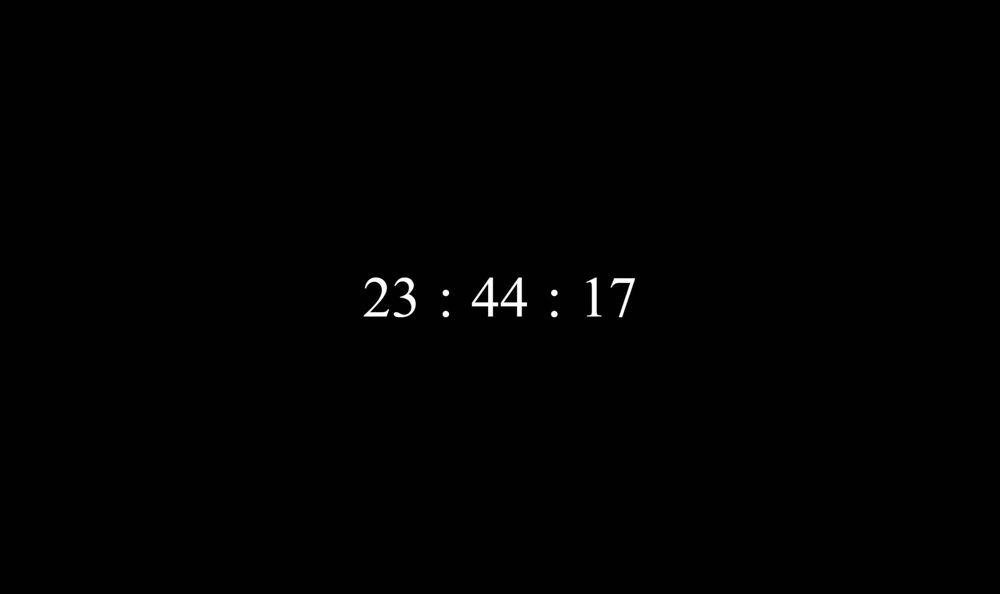
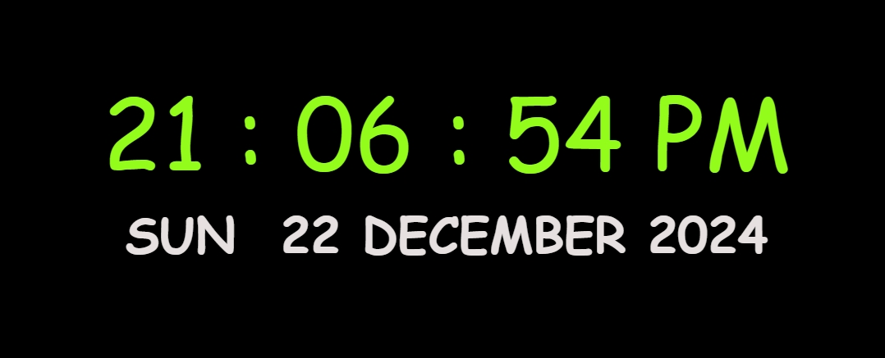
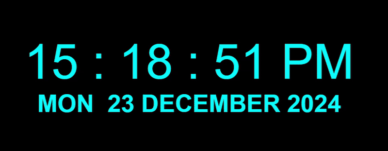
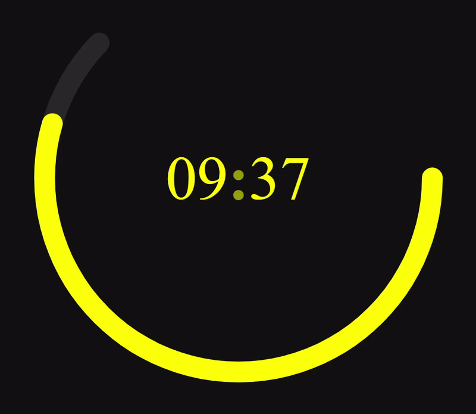

# Digital Clock Collection

This repository features a collection of digital clocks, implemented using HTML, CSS, and JavaScript. Each style is designed to be responsive and visually appealing, demonstrating different techniques and design choices for creating digital clocks.

## Folder Structure

```plaintext
digital-clock/
├── style1/
│   ├── index.html
│   ├── style.css
│   └── script.js
├── style2/
│   ├── index.html
│   ├── style.css
│   └── script.js
└── ...

```

## Screenshots

### Style 1



### Style 2


### Style 3



### Style 4


### Style 5


### Style 6



### Style 7


